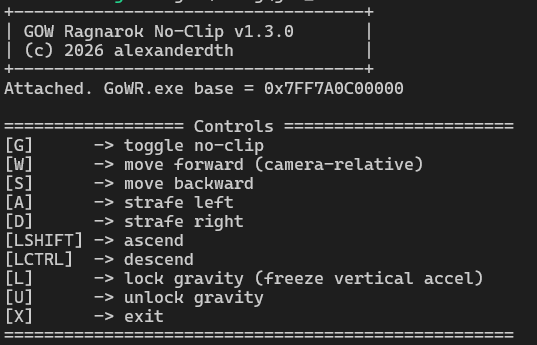

# God Of War: Ragnarok - No Clip

Fly around God of War Ragnarok on PC. Windows only. Launch the game, then launch this.

### Important
This will probably not work properly with a controller. I did not test it. But on mouse and keyboard, it works fine. I am saying this, simply because, you do use your mouse to pan the camera.

## Controls

- **G** — toggle no-clip
- **X** — kill the program
- **WASD** — move relative to camera (yaw AND pitch, so mid-air feels right)
- **LShift / LCtrl** — ascend / descend
- **L / U** — lock / unlock gravity (default: locked, so you don't yeet through the map)

## How it hooks in

External. No DLL injection, no code hooks. Attaches with [`libmem`](https://github.com/rdbo/libmem) and reads/writes memory directly. Two anchors, both static offsets from `GoWR.exe`:

- **Player entity** at `[+0x29EBB00]` — position `Vec4` at `+0x3E0`, world-up at `+0x3E4`, body yaw at `+0x400`, vertical accel at `+0x3F4`.
- **Active camera** at `[+0x4025928]` — output yaw at `+0x12DC`, pitch at `+0x12E0`, right/up/back basis vectors at `+0xF00 / +0xF10 / +0xF20`.

Movement math is `dx = right · intent_x + forward · intent_z`, where `forward = -back` (the game stores view-space "behind"). No trig, no gimbal weirdness, pitch is honored for free.

## RE notes

The old build used a yaw pointer chain that went dead after a game patch. Value scans were drowning in coincidental hits until I found the script binding table (currently `sub_7FF7A0CCF4E0`) — GoWR exposes a scripting API and every `GetOrbitForward` / `GetOutputYaw` binding decompiles into a one-liner that reads the actual camera field. Ten minutes of IDA got what a whole day of scanning couldn't. (God, I love IDA).

There was also a fun aliasing bug in the old code: `FORWARD_PTR` and `LEFT_RIGHT_PTR` resolved to the same 4 bytes, so both writes hit the same address and the second one won. That's why WASD felt like it was rotating with the camera before — it wasn't; you were only ever moving on one axis at a time. Fixed.

## Build

```bash
cargo build --release
```

## Deps

- [`libmem`](https://github.com/rdbo/libmem) — memory RW
- [`device_query`](https://crates.io/crates/device_query) — keyboard polling
- `figlet-rs` — historical (was for the banner, unused now)

## Screenshots




